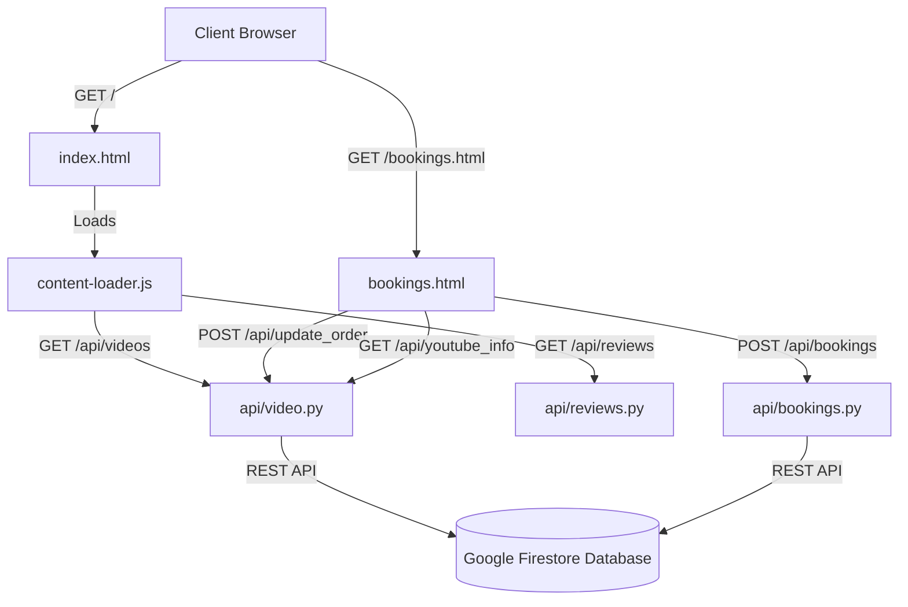

# 🌌 Dee J Productions — Project Blueprint

This blueprint serves as a developer index and system map for the **Dee J Productions** web portfolio. It outlines the frontend elements, the serverless backend API design, database schemas, and security settings, allowing developers and AI agents to quickly understand the codebase without reading files line-by-line.

---

## 📂 Project Architecture

---

## 🗺️ File Directory Map

### 🎨 Frontend Assets (Root Directory)
*   **[index.html](file:///c:/Users/deepa/Downloads/PRacto%20portfolio/PRacto%20pr/index.html)**: The main public landing page. Features cinematic video rows, a shorts gallery mockup, client reviews, and an interactive booking booking form.
*   **[bookings.html](file:///c:/Users/deepa/Downloads/PRacto%20portfolio/PRacto%20pr/bookings.html)**: The secure admin manager dashboard. Controls booking briefs, video content, showreel configurations, and reviews.
*   **[index.css](file:///c:/Users/deepa/Downloads/PRacto%20portfolio/PRacto%20pr/index.css)**: Core style declarations. Implements the matte black `#050505` and neon yellow `#dfff00` speed-theme, responsive flex grids, custom scrolls, and glassmorphism tabs.
*   **[app.js](file:///c:/Users/deepa/Downloads/PRacto%20portfolio/PRacto%20pr/app.js)**: Animation timeline script. Runs GSAP scroll trigger sequences, cursor glowback followers, and smooth scroll behaviors.
*   **[content-loader.js](file:///c:/Users/deepa/Downloads/PRacto%20portfolio/PRacto%20pr/content-loader.js)**: Frontend database hydration. Queries public GET APIs dynamically on load and renders cards prior to GSAP calculations.
*   **[sound-manager.js](file:///c:/Users/deepa/Downloads/PRacto%20portfolio/PRacto%20pr/sound-manager.js)**: Audio engine. Manages ambient rain track blending, sound control nodes, and mute settings.
*   **[three-bg.js](file:///c:/Users/deepa/Downloads/PRacto%20portfolio/PRacto%20pr/three-bg.js)**: Interactive 3D WebGL background shader.

### ⚡ Serverless Python API ([api/](file:///c:/Users/deepa/Downloads/PRacto%20portfolio/PRacto%20pr/api))
All API endpoints run as Vercel serverless Python 3.12 handlers. They access Firestore using standard libraries (`urllib`) for rapid execution:
*   **[api/video.py](file:///c:/Users/deepa/Downloads/PRacto%20portfolio/PRacto%20pr/api/video.py)**: *Unified Video Controller*. Mapped by Vercel rewrites to handle all video-related actions under a single function, circumventing Vercel's Hobby plan limit of 12 serverless functions.
*   **[api/booking.py](file:///c:/Users/deepa/Downloads/PRacto%20portfolio/PRacto%20pr/api/booking.py)**: Registers public client bookings.
*   **[api/bookings.py](file:///c:/Users/deepa/Downloads/PRacto%20portfolio/PRacto%20pr/api/bookings.py)**: Lists active bookings (requires authentication).
*   **[api/delete_booking.py](file:///c:/Users/deepa/Downloads/PRacto%20portfolio/PRacto%20pr/api/delete_booking.py)**: Soft-deletes a booking to `deleted_bookings` and appends a 60-day expiry date.
*   **[api/deleted_bookings.py](file:///c:/Users/deepa/Downloads/PRacto%20portfolio/PRacto%20pr/api/deleted_bookings.py)**: Lists recycled bookings (requires authentication).
*   **[api/restore_booking.py](file:///c:/Users/deepa/Downloads/PRacto%20portfolio/PRacto%20pr/api/restore_booking.py)**: Restores a recycled booking back to active list.
*   **[api/permanent_delete.py](file:///c:/Users/deepa/Downloads/PRacto%20portfolio/PRacto%20pr/api/permanent_delete.py)**: Purges a booking record forever.
*   **[api/reviews.py](file:///c:/Users/deepa/Downloads/PRacto%20portfolio/PRacto%20pr/api/reviews.py)**: Publicly queries review documents.
*   **[api/add_review.py](file:///c:/Users/deepa/Downloads/PRacto%20portfolio/PRacto%20pr/api/add_review.py)**: Publishes client reviews (requires authentication).
*   **[api/delete_review.py](file:///c:/Users/deepa/Downloads/PRacto%20portfolio/PRacto%20pr/api/delete_review.py)**: Deletes reviews (requires authentication).

---

## 🔗 API Endpoint Routing (`vercel.json`)

Vercel maps requests matching incoming URLs to python scripts. In particular, endpoints ending with `/api/videos`, `/api/add_video`, etc., are rewritten to `api/video.py` appending an `action` query parameter to route calls correctly:

| Method | Source URL | Rewritten Target Path | Handler Operation |
| :--- | :--- | :--- | :--- |
| **POST** | `/api/booking` | `api/booking.py` | Creates client briefing |
| **GET** | `/api/bookings` | `api/bookings.py` | Lists active briefings |
| **POST** | `/api/delete_booking` | `api/delete_booking.py` | Recycles brief record |
| **GET** | `/api/deleted_bookings` | `api/deleted_bookings.py` | Lists recycled briefings |
| **POST** | `/api/restore_booking` | `api/restore_booking.py` | Restores recycled record |
| **POST** | `/api/permanent_delete` | `api/permanent_delete.py` | Purges brief record |
| **GET** | `/api/videos` | `api/video.py?action=list` | Lists portfolio videos |
| **POST** | `/api/add_video` | `api/video.py?action=add` | Publishes portfolio video |
| **POST** | `/api/delete_video` | `api/video.py?action=delete` | Deletes portfolio video |
| **POST** | `/api/update_video` | `api/video.py?action=update` | Saves video edits |
| **POST** | `/api/update_order` | `api/video.py?action=update_order` | Saves dragged list order |
| **GET** | `/api/youtube_info` | `api/video.py?action=youtube_info` | Fetches YouTube title (oEmbed) |
| **GET** | `/api/reviews` | `api/reviews.py` | Lists client reviews |
| **POST** | `/api/add_review` | `api/add_review.py` | Publishes client review |
| **POST** | `/api/delete_review` | `api/delete_review.py` | Deletes review record |

---

## 🔒 Security Design

### 1. Zero Static Credentials Leakage
No plain text credentials (like passwords or authorization keys) are hardcoded in the client-side files of this repository.
*   **Authentication**: Dashboard inputs generate a Base64 authorization header on submit: `btoa(username + ':' + password)`.
*   **Verification**: The script tests this token against the `/api/bookings` endpoint. If valid, the token is saved dynamically inside `sessionStorage.getItem('admin_token')` for the tab session duration (it is never saved on disk or cookies).
*   **Validation**: Backend scripts check the `Authorization` header against the expected value: `Basic RGVlcGFrOjMzMjE=`. Unauthorized calls fail with `401 Unauthorized`. If the dashboard catches a 401 response, it purges the local session variables and forces the user back to the login modal.

### 2. Cross-Site Scripting (XSS) Prevention
Any booking, review, or video inputs compiled dynamically into the dashboard HTML are sanitized via an explicit escaping method (`escapeHtml`), converting special characters (`&`, `<`, `>`, `"`, `'`) to their safe HTML entities.

---

## ⚙️ Key Technical Implementations

### 1. YouTube oEmbed Fetching
To bypass Google's anti-bot blocks on data center IP addresses (which causes standard scraping of `youtube.com/watch` pages to return captcha blocks on Vercel), video titles are fetched via YouTube's official oEmbed JSON endpoint:
`https://www.youtube.com/oembed?url=https://www.youtube.com/watch?v=VIDEO_ID&format=json`

### 2. Firestore REST Type Casting
Because the Firestore REST JSON API represents `integerValue` fields as **strings** inside the JSON body (e.g. `{"integerValue": "1"}`), all writes (additions, edits, drag order reindexing) parse integers safely through python code and wrap the resulting integers as strings in JSON payloads.

### 3. Drag-and-Drop Sorting (Stable Drop & Highlight)
Lists utilize native HTML5 dragging on `.cms-item-card[draggable="true"]`.
*   **Preventing Drags Cancellations**: Child elements are styled with `user-select: none` and `-webkit-user-drag: element` to ensure the browser captures the card as a single entity, and the start handler sets compatibility context using `e.dataTransfer.setData('text/plain', ...)` to prevent Firefox from aborting the drag.
*   **No Flicker**: The DOM elements are only shifted inside the `drop` event listener (exactly once when the user releases the mouse). The path of entry is highlighted using a neon boundary border (`border-top: 2px solid var(--color-neon)`) during `dragover`. This completely avoids page flickering or cursor desynchronizations during reordering.
